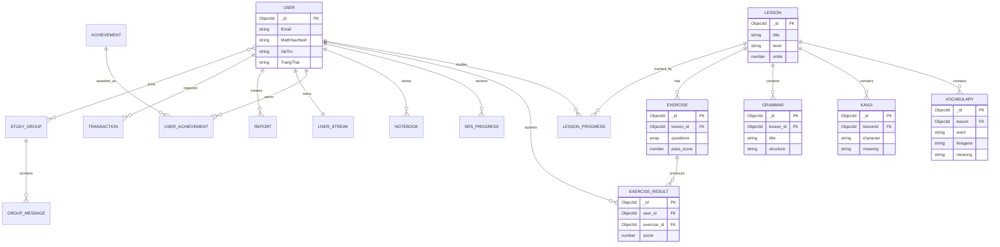

# Sơ đồ dữ liệu mức domain

Sơ đồ tập trung vào các quan hệ quan trọng cho phần trình bày. Tên field chi tiết nằm trong `BackEnd/model/`.

MongoDB không áp dụng foreign key ở tầng database; controller và Mongoose validation chịu trách nhiệm kiểm tra tham chiếu. Các relation phục vụ truy vấn thường có index trong schema.
