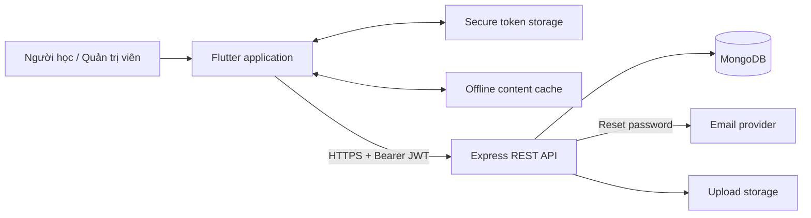
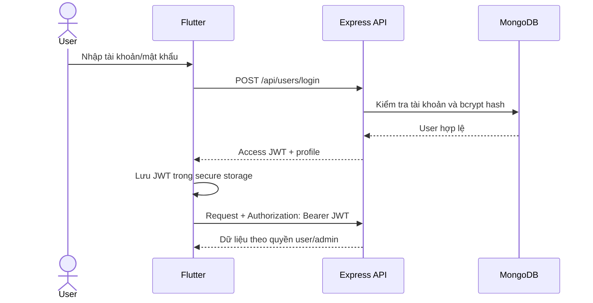
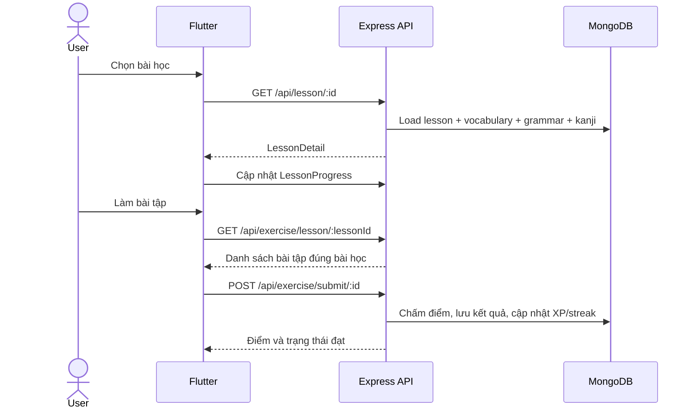

# Sơ đồ kiến trúc hệ thống

## Thành phần chính

Flutter tổ chức theo feature và chỉ truy cập HTTP qua `ApiClient`. Backend mount route theo domain; middleware xác thực/phân quyền chạy trước controller. Controller dùng Mongoose model để đọc/ghi MongoDB.

## Luồng xác thực

## Luồng học bài và làm bài tập

## Ranh giới bảo mật

- Access token lưu bằng secure storage; cache ngoại tuyến không lưu token.
- Route quản trị dùng `authenticateAdmin`.
- Login, forgot/reset password có rate limit.
- Upload giới hạn kích thước và kiểm tra MIME + phần mở rộng.
- Production dùng CORS whitelist và không trả stack/error nội bộ.
